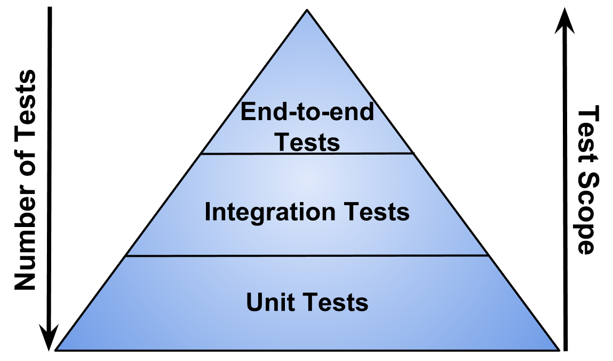
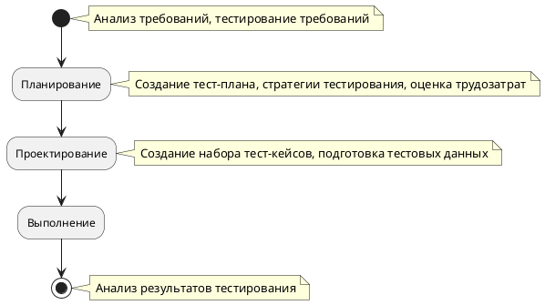
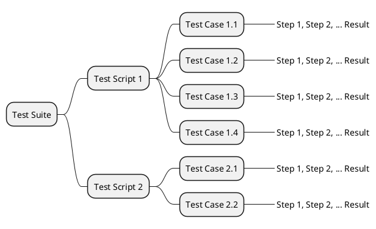

# Архитектура

Архитектура изложена на основе того, что в нашем случае тестирование:

* Функциональное
* Регрессионное
* Сквозное

## Основные концепции

При сквозном тестировании (End-To-End, E2E или Chain testing)
мы проверяем всю систему в целом, эмулируя пользовательские сценарии.
Оно находится на вершине так называемой пирамиды тестирования:



Цикл тестирования описывает порядок наших действий:



План тестирования (Test Plan) – формализованное и укрупненное описание одной сессии
тестирования по одному или нескольким направлениям проверок.
План состоит из совокупности тестовых сценариев и тестовых случаев.

Тестовый сценарий (Test Script) – последовательность действий над приложением,
которые связаны единым ограниченным бизнес-процессом использования, и
сообразных им проверок корректности поведения приложения в ходе этих действий.
Особенностью является линейность действий и проверок,
т.е. зависимость последующих действий и проверок от успешности предыдущих.

Тестовый случай или тест-кейс (Test Case) – формализованное описание одной показательной
проверки на соответствие требованиям прямым или косвенным.

Тестовый комплект или набор (Test Suite) – некоторый набор
формализованных тестовых случаев,
объединенных между собой по общему логическому признаку.



Мы выделяем 3 основных тестовых набора:

* `smoke` - набор дымовых тестов.
  Задача этого набора тестов - выявить серьёзные проблемы как можно раньше и
  отклонить/вернуть сборку на доработку
  на раннем этапе тестирования, чтобы не углубляться в долгие и сложные тесты.
  Тесты выполняются каждый раз при сборке приложения.
  Дымовой набор состоит из тестов, описывающих действия пользователей.
  Например, оплата продукта или отправка сообщения в чат.

* `full` - набор полных регрессионных тестов.
  Тесты этой группы выполняют проверку, что добавленные функции
  приложения и исправленные дефекты не оказали влияния на текущую,
  уже существующую функциональность, работавшую (и протестированную) ранее.
  Полный набор состоит из тестов, описывающих объекты приложения.
  Например страница входа или страница настроек.

* `issues` - набор тестов на функционал, привязанный к определенным
  задачам и которые не включены в предыдущие наборы.

Под каждую сущность или группу тестовых сценариев выделяется отдельная
директория, внутри которых находятся тесты (`spec` файлы),
каждый сценарий в отдельном тесте.
Имена тестов определяем на основе родительских директорий,
чтобы можно было по маске сделать выборку необходимых для запуска тестов

Во всех тестовых сценариях мы используем конструкцию Given-When-Then (GWT).
Такая конструкция позволяет описывать изначальное состояние, набор действий
и ожидаемый результат.

`Given` - описывает сущность, (например страницу) и начальные условия,
с которыми выполняется тест. Реализован в блоке `context`.

`When` - описывает действия пользователя с позииции
пользовательского сценария.
Реализован в блоке `describe`

`Then` - описывает ожидаемый результат действий и проверки. Реализован в блоке `it`.

Пример структуры теста:

```js
context('User on login page', () => {  // Given

  describe('Guest user opens login page', () => { // When

    before(() => { // Action
      ...
    });

    it('Title should be correct', () => { // Then
      ...
    });

  });

});
```

## Слои приложения

```plantuml
skinparam monochrome true

package "e2e" {


  package  "Plugins" as Plugins  {
  [Плагины]
  }

  package "Integration" as Integration {
    [ваш-тест.spec]
  }

  package "Suppot" as Support {
    [Глобальные комманды]

  package "Functions" as Functions {
    [commands.js]
  }

}

package "Fixtures" as Fixtures {
  [ответ-от-сервера.json]
}

note right of run : Глобальный обьект взаимодействующий с браузером

[Глобальные комманды] -down- run

[ваш-тест.spec] --> run

[ваш-тест.spec] ---> [commands.js]

[commands.js] ---> [ответ-от-сервера.json]
}

```

### Фикстуры

Фикстуры (fixtures) используются для предоставления доступа к тестовым данным.
Это могут быть изображения, JSON файлы, ответы/запросы к серверу и т.д.
Файлы фикстур расположены в `cypress/fixtures` по умолчанию.

### Команды

Команды (commands) используются для хранения переиспользуемого кода или для
подготовки окружения с заранее фиксированным/известным состоянием.
[Cypress][1] использует файл `cypress/support/index.js`,
который запускается перед каждым тестом. Его не нужно импортировать.
Остальные команды можно записывать в `cypress/support/commands.js`

### Плагины

Плагины (plugins) - это сторонние библиотеки, используемые для тестирования.
Файлы плагинов расположены в `cypress/plugins` по умолчанию.
[Cypress][1] включает файл `cypress/plugins/index.js`
перед запуском каждого теста.

## Структура директорий

После добавления нового проекта [Cypress][1] автоматически создает
следующую структуру директорий:

```yml
/cypress
  /fixtures
    - example.json

  /integration
    /examples
      - actions.spec.js
      - aliasing.spec.js
      - assertions.spec.js
      - connectors.spec.js
      - cookies.spec.js
      - cypress_api.spec.js
      - files.spec.js
      - local_storage.spec.js
      - location.spec.js
      - misc.spec.js
      - navigation.spec.js
      - network_requests.spec.js
      - querying.spec.js
      - spies_stubs_clocks.spec.js
      - traversal.spec.js
      - utilities.spec.js
      - viewport.spec.js
      - waiting.spec.js
      - window.spec.js

  /plugins
    - index.js

  /support
    - commands.js
    - index.js
```

Файлы тестов расположены в `cypress/integration` по умолчанию и
могут быть записаны в виде:

* .js
* .jsx
* .coffee
* .cjsx

Пример структуры тестов:

```sh
integration
├── smoke
│   ├── login_as_admin_and_approve_new_user_spec.js
│   ├── login_as_user_and_send_message_spec.js
│   └── ....js
├── full
│   ├── private
│   │    └── login
│   │        ├── user
│   │        │   ├── pos_admin_logout_spec.js
│   │        │   ├── pos_admin_login_spec.js
│   │        │   ├── neg_admin_login_spec.js
│   │        │   ├── user_home_page
│   │        │   │   ├── items_list
│   │        │   │   │   ├── like_item_spec.js
│   │        │   │   │   ├── add_to_cartitem_spec.js
│   │        │   │   │   ├── select_item_spec.js
│   │        │   │   │   └── ...
│   │        │   │   └── cart
│   │        │   │       ├── remove_item_spec.js
│   │        │   │       ├── change_item_spec.js
│   │        │   │       └── ...
│   │        │   └── profile
│   │        │       ├── avatar_spec.js
│   │        │       ├── change_password_spec.js
│   │        │       ├── change_emal_spec.js
│   │        │       └── ...
│   │        └── admin
│   │            ├── pos_admin_logout_spec.js
│   │            ├── pos_admin_login_spec.js
│   │            ├── neg_admin_login_spec.js
│   │            ├── user_list
│   │            │   ├── ....js
│   │            │   └── ...
│   │            ├── add_user
│   │            │   ├── ....js
│   │            │   └── ...
│   │            └── remove_user
│   │                ├── ....js
│   │                └── ...
│   └── public
│       ├── main_public_spec.js
│       └── ...
└── issues
    ├── issue_1123_spec.js
    └── ...
```

[1]:https://www.cypress.io
