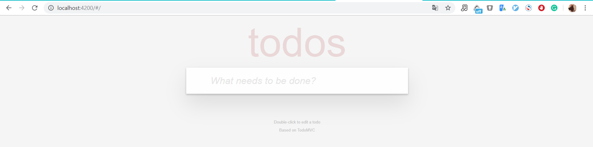
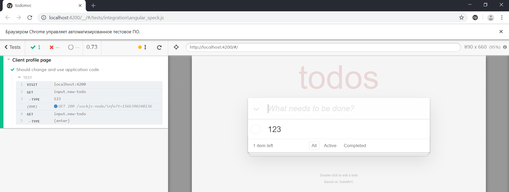
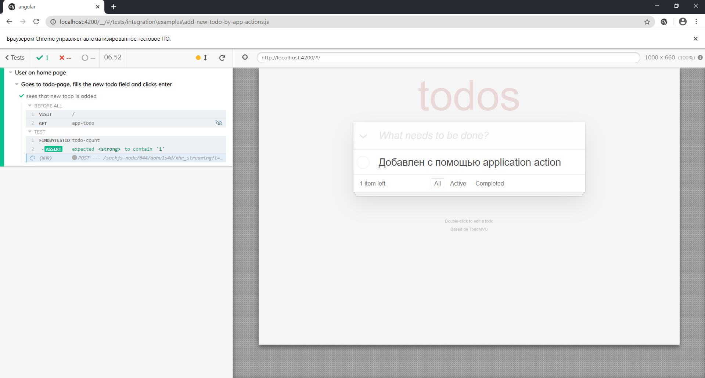
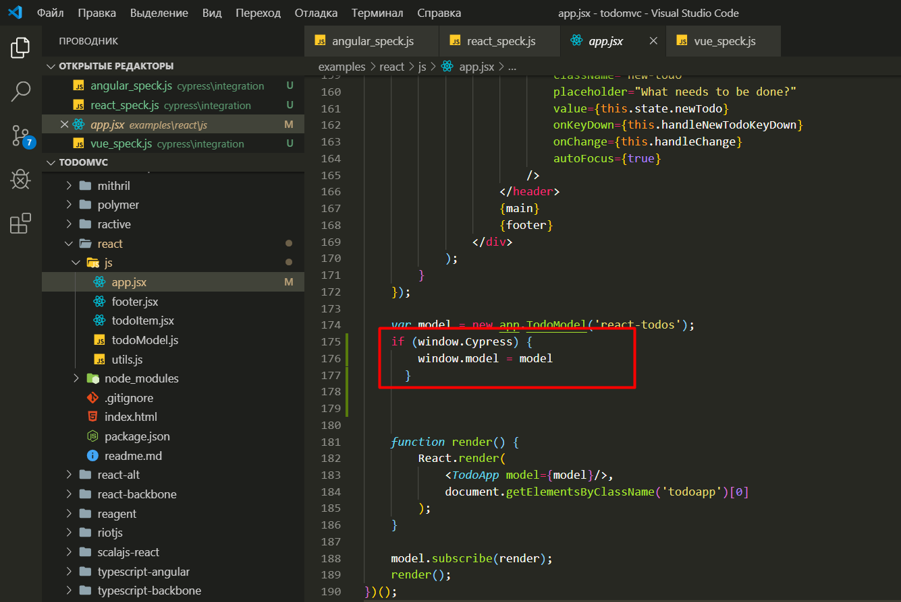

# Лучшие практики

## Page Object

Мы отказались от использования Page Object потому что:

* Требует много времени на поддержку, отвлекает от написания тестовых сценариев.
* Усложняется написание тестов и анализ ошибок из-за наличия дополнительного состояния.
* Заставляет использовать единый интерфейс, что приводит к условной логике тестов.
* Замедляется выполнение тестов из-за прохода по всему интерфейсу.

## Application actions

Это паттерн, позволяющий вызывать или изменять методы приложения
прямо в тестах [Cypress][2], при этом скорость выполнения метода приложения
выше чем у варианта с стандартным методом.

Рассмотрим **Application actions** в действии, на примере приложения [TodoMVC][4].



Приложение TodoMVC — это список дел.
Дела можно добавлять, помечать как выполненные и удалять.
Допустим, что мы хотим проверить создание нового дела.

Если бы писали обычный авто-тест, тогда это бы выглядело так:

```js
/// <reference types="cypress" />

context('User on home page', () => {
  describe('Goes to todo-page, fills the new todo field and clicks enter', () => {
    before(() => {
      cy.visit('/');
      cy.findByTestId('todo-input').type('123{enter}');
    });

    it('sees that new todo is added', () => {
      cy.findByTestId('todo-count').should('contain', '1');
    });
  });
});
```

запустим:



Как видно из кода, для добавления мы нашли input, в который написали '123' и
нажали enter.

### Выполнение действия с помощью метода

C помощью Application actions мы можем избежать выборки элементов,
реального заполнения поля и выполнения событий в браузере,
а сразу заполнить форму.

Выполним это же действие с помощью уже готовых методов приложения.
Находим в компонентах Angular'a метод добавления и вызываем его в тесте:

```js
/// <reference types="cypress" />

context('User on home page', () => {
  describe('Goes to todo-page, fills the new todo field and clicks enter', () => {
    before(() => {
      cy.visit('/');
      cy.get('app-todo').then((elem) => {
        const el = elem[0];
        const win = el.ownerDocument.defaultView;
        const component = win.ng.probe(el).componentInstance;
        component.create('Добавлен с помощью application action');
      });
      cy.get('app-root').click({ force: true });
    });

    it('sees that new todo is added', () => {
      cy.findByTestId('todo-count').should('contain', '1');
    });
  });
});
```

Запускаем тест:



### Изменение метода для теста

С помощью application actions можно не только вызывать методы компонента,
но и изменять их поведение. Такой вариант, например, может помочь
в случае перехода на сторонний ресурс который тестировать не нужно.
Мы просто можем вернуть необходимый ответ, либо пропустить
какое-то действие метода.

Допустим что у нас есть 1000 задач.
И нам необходимо очистить список.

Опишем в нашем тесте следующее:

```js
...
before(() => {
  cy.visit('/');
  cy.get('app-todo').then((elem) => {
    const el = elem[0];
    const win = el.ownerDocument.defaultView;
    const component = win.ng.probe(el).componentInstance;
    for (let index = 0; index < 1000; index++) {
      component.create(`Добавлен с помощью application action ${index}`);
    }
    component.delete = () => {
      component.todoService.todos = [];
      component.todoService.save();
    };
    component.delete();
  });
});
...
```

Теперь метод `delete` выполняет очистку всего списка дел.
Таким образом можно менять любой компонент приложения,
если это необходимо для тестирования.

### Пример изменения метода для Vue.js

Рассмотрим выполнение выше описанных действий на примере `Vue.js`.

Для изменения и вызова метода, нам понадобится:

```js
context('User on home page', () => {
  describe('Goes to todo-page, fills the new todo field and clicks enter', () => {
    before(() => {
      cy.visit('/');
      cy.window().its('app').then((component) => {
        for (let index = 0; index < 1000; index++) {
          component.newTodo = `Добавлен с помощью application action ${index}`;
          component.addTodo();
          component.todos = [];
        }
      });
    });
  });
});
```

### Пример изменения компонента для React

Теперь пример выше описанных изменений выполним для `React`.

В первую очередь, необходимо, изменить `app.jsx`/`app.tsx`, добавив туда следующее:

```js
if (window.Cypress) {
  window.model = model;
}
```



Теперь к компонентам можно обращаться также как и в `Vue.js`:

```js
context('User on home page', () => {
  describe('Goes to todo-page, fills the new todo field and clicks enter', () => {
    before(() => {
      cy.visit('/');
      cy.window().its('model').then((component) => {
        for (let index = 0; index < 1000; index++) {
          component.addTodo(`Добавлен с помощью application action ${index}`);
          component.todos = [];
        }
      });
    });
  });
});
```

## API Actions

Это патерн, который позволяет посылать или принимать запросы с сервера, в обход
пользовательского интерфейса. Когда нам нужно обойти DOM
и без UI выполнить действия для
подготовки тестовой среды, мы используем api actions.
Так тесты работают в большей изоляции и с большей скоростью.

Например, нам необходимо реализовать вход пользователя в систему.
Для этого, можно создать команду, которая будет делать запрос к API и устанавливать
полученный токен пользователя:

```js
Cypress.Commands.add('login', () => {
  cy.request({
    method: 'POST',
    url: 'http://localhost:3000/api/users/login',
    body: {
      user: {
        email: 'joe@example.com',
        password: 'joe',
      }
    }
  })
  .then((resp) => {
    window.localStorage.setItem('jwt', resp.body.user.token);
  });
});
```

## Множественные проверки

Асинхронность [Cypress][2] нарушает состояния между тестами,
поэтому излишне изолированные проверки замедляют работу.
Рекомендуется использовать множественные проверки из нескольких
элементарных в одном тесте, они будут работать быстрее.

:::tip Рекомендуется

```js
it('firstname input should be correct', () => {
  cy.findByTestId('firstname-input')
    .type('Johnny')
    .should('have.attr', 'data-validation', 'required')
    .and('have.class', 'active')
    .and('have.value', 'Johnny');
});
```

:::

:::danger Не рекомендуется

```js
it('firstname input should be correct', () => {
  cy.findByTestId('firstname-input').type('Johnny');
});

it('firstname input should have attribute "data-validation", "required"', () => {
  cy.findByTestId('firstname-input').should('have.attr', 'data-validation', 'required')
});

it('firstname input should have value "Johnny"', () => {
  cy.findByTestId('firstname-input').should('have.value', 'Johnny');
});
```

:::

## Ожидание элементов

Явное ожидание устанавливается в каждой команде через параметр
в миллисекундах, например:

```js
cy.findByTestId('genedata-item-status-uploaded', { timeout: 5000 });
```

Неявное ожидание устанавливается через [конфигурацию][7] [Cypress][2].

## Управление курсором

```js
cy.findByTestId('slider-dot')
  .trigger('mouseover')
  .trigger('mousedown')
  .trigger('mousemove',  150, 50, { force: true })
  .trigger('mouseup');
```

## Popover

```js
cy.findByTestId(applyButton)
  .click()
  .then(() => {
    if (Cypress.$(popover.content).is(':visible')) {
      cy.get(popover.buttons.ok).click();
      cy.get(popover.content).should('not.be.visible');
    }
  });
```

## Invoke

```js
cy.findByTestId(price)
  .invoke('text')
  .as('currentPrice')
  .should('be.eq', '200');

cy.get('@currentPrice').then((price) => {
  cy.findByTestId('newprice-input')
    .type(price_num)
    .invoke('value')
    .should('be.eq', price_num);
});
```

## Тестирование iframe

Необходимо создать команду в файле `commands.js` для дальнейшего переиспользования:

```js
Cypress.Commands.add('getIframeBody', (name) => {
  cy.get(`iframe[name="${name}"]`)
    .its('0.contentDocument')
    .should('exist')
    .its('body')
    .should('not.be.undefined')
    .then(cy.wrap)
});
```

В тесте, где необходимо обратиться к `iframe`, вызываем созданную команду:

```js
cy.getIframeBody('__privateStripeFrame').find('input[name="cardnumber"]').type('4242424242424242');
```

## Загрузка файлов

Для загрузки файлов на внешний ресурс используется
плагин [cypress-file-upload][6].
Загружаемые файлы необходимо размещать в `./cypress/fixtures`.

Добавляем в `./cypress/support/commands.js`:

```js
import 'cypress-file-upload';
```

Используем метод `.attachFile(fileName)` в тесте:

```js
cy.findByTestId('file-input').attachFile('file.txt');
```

## Визуальное тестирование

Если вам необходимо проверить вёрстку для разных разрешений или проверить
отрисовку canvas'a можно использовать визуальное тестирование.

Для простого сравнения скриншотов можно использовать [cypress-image-snapshot][5].

### Установка

Из корня проекта запустить команду:

`npm install --save-dev cypress-image-snapshot`

### Настройка

Добавляем в `.cypress/plugins/index.js`:

```js
const {
  addMatchImageSnapshotPlugin,
} = require('cypress-image-snapshot/plugin');

module.exports = (on, config) => {
  addMatchImageSnapshotPlugin(on, config);
};
```

и в `./cypress/support/commands.js` добавим:

```js
import { addMatchImageSnapshotCommand } from 'cypress-image-snapshot/command';

addMatchImageSnapshotCommand();
```

### Синтаксис

```js
// Сравнить скриншот:
.matchImageSnapshot();
.matchImageSnapshot(name);
.matchImageSnapshot(options);
.matchImageSnapshot(name, options);
```

### Использование

В тестах:

```js
describe('Login', () => {
  it('should be publicly accessible', () => {
    cy.visit('/login');

    // snapshot name will be the test title
    cy.matchImageSnapshot();

    // snapshot name will be the name passed in
    cy.matchImageSnapshot('login');

    // options object passed in
    cy.matchImageSnapshot(options);

    // match element snapshot
    cy.get('#login').matchImageSnapshot();
  });
});
```

[1]:https://docs.cypress.io/plugins/index.html
[2]:https://cypress.io
[3]:https://www.cypress.io/blog/2019/01/03/stop-using-page-objects-and-start-using-app-actions/
[4]:http://todomvc.com
[5]:https://www.npmjs.com/package/cypress-image-snapshot
[6]:https://www.npmjs.com/package/cypress-file-upload
[7]:https://docs.cypress.io/guides/references/configuration.html#Timeouts
